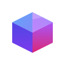

<p align="center">
  
</p>

<h1 align="center">EdgeBase</h1>

<p align="center">
  <b>100x cheaper than Firebase. ~0ms cold starts. Near-unlimited scale.</b><br>
  Open-source edge-native BaaS that runs on Edge, Docker, and Node.js
</p>

<p align="center">
  <a href="https://github.com/edge-base/edgebase/blob/main/LICENSE"></a>&nbsp;
  <a href="https://www.npmjs.com/package/create-edgebase"></a>&nbsp;
  <a href="https://github.com/edge-base/edgebase/stargazers"></a>&nbsp;
  <a href="https://github.com/edge-base/edgebase/actions"></a>
</p>

<p align="center">
  Auth · Database · Realtime · Storage · Functions · Admin UI<br>
  Same app across local, self-hosted, and global edge
</p>

---

## Get Started in 30 Seconds

```bash
npm create edgebase@latest my-app
cd my-app

npx edgebase dev                # Local dev + Admin Dashboard
npx edgebase docker run         # Self-host with Docker
npx edgebase deploy             # Deploy globally on Cloudflare
```

Same codebase, familiar workflow — choose your runtime, switch when you need to.

`npm create edgebase@latest` now starts from a blank app data model: auth, storage, and a sample health function are scaffolded, and dependencies are installed automatically. In local dev, the API runs on `http://localhost:8787` and the Admin Dashboard opens on `http://localhost:8787/admin`.

Guides: [Quickstart](https://edgebase.fun/docs/getting-started/quickstart) · [Configuration](https://edgebase.fun/docs/getting-started/configuration) · [Deployment](https://edgebase.fun/docs/getting-started/deployment) · [Self-Hosting](https://edgebase.fun/docs/getting-started/self-hosting) · [Admin Dashboard](https://edgebase.fun/docs/admin-dashboard)

## Why EdgeBase?

### Why I Built EdgeBase

I did not build EdgeBase because existing BaaS products were bad. I built it out of real gratitude for what they made possible. It came from using them seriously, learning from their strengths, and repeatedly running into tradeoffs that became harder to ignore as products grew.

Firebase pioneered the modern BaaS experience and still deserves respect, but its pricing can become hard to justify as usage grows. Supabase gave the community a real gift with an open-source BaaS that made this space more accessible and more transparent, but self-hosting was still operationally complex, some capabilities differ between the open-source and hosted versions, and at scale its hosted pricing is not dramatically different from Firebase. PocketBase made getting started feel unusually elegant, but for larger production systems the upgrade path can become harder than it first appears.

I built EdgeBase to keep the simplicity that made those tools compelling while removing the tradeoffs that kept surfacing in practice. Thanks to Miniflare, it can still start with the kind of immediacy that made PocketBase feel elegant. And thanks to Cloudflare Durable Objects and serverless PostgreSQL options like Neon, it can grow toward planet-scale workloads without forcing a rewrite. It was designed from day one for serverless compute rather than adapted to it later. That is why Cloudflare is a first-class runtime for EdgeBase, and why its low cost, near-zero cold starts, and near-unlimited scale all come from the same architectural decision. EdgeBase is my answer to that question — and I hope it becomes yours too.

### Why Can It Be Much Cheaper?

| Component                   | Firebase       | Supabase       | Appwrite       | **EdgeBase** |
| --------------------------- | -------------- | -------------- | -------------- | ------------ |
| Auth (1M MAU)               | $4,415         | $2,925         | $2,400         | **$0**       |
| Egress (100 TB)             | $12,000        | $8,978         | $14,700        | **$0**       |
| DB Subscriptions (900M msg) | $5,400         | $2,263         | $630           | **$0**       |
| DB + Compute + Storage      | $233           | $131           | $136           | $149         |
| **Total**                   | **$22,048/mo** | **$14,297/mo** | **$17,866/mo** | **~$149/mo** |
| **vs EdgeBase**             | **148x more**  | **96x more**   | **120x more**  | **—**        |

> Self-hosted (Docker): **VPS cost only**.

Traditional BaaS costs scale with **users**. EdgeBase costs scale with **compute**. The gap starts at 10–20x with 10K users — and widens to **95–148x at 1M users**.

How is $0 possible? These aren't discounts — the infrastructure that generates those costs doesn't exist:

- **Auth $0** — JWT verification runs as local crypto inside the Worker. No auth server to scale or bill for.
- **Egress $0** — Files serve from R2, which charges zero egress by design. 100 TB out? Still $0.
- **DB Subscriptions $0** — Messages broadcast inside a single Durable Object. No fan-out infrastructure, no per-message billing.
- **Idle connections $0** — WebSocket Hibernation API frees memory when connections go idle. 10K sleeping connections cost nothing.

<details>
<summary><b>Scenario details & sources</b></summary>

**Scenario** — social app with image feeds, likes, comments, real-time notifications:
1M MAU, ~100K DAU (10%), 30 DB reads / 8 writes / 1 delete per user per day, 50 GB database, 2 TB file storage (user images/video), 100 TB monthly egress (feed image serving), 900M database subscription messages/month (each user action fans out to ~10 recipients — other providers count per-recipient, EdgeBase broadcasts inside a DO with no per-message billing).

**Unit prices (as of February 2026):**

- **Firebase** Auth — 50K free, 50K–100K at $0.0055, 100K–1M at $0.0046/MAU ([source](https://firebase.google.com/pricing)). Firestore — reads $0.03/100K, writes $0.09/100K, deletes $0.01/100K, storage $0.15/GB. Realtime Database — downloads $1/GB (10 GB free), assuming ~6KB per realtime message ([source](https://firebase.google.com/docs/database/usage/billing)). Cloud Storage $0.026/GB, egress $0.12/GB.
- **Supabase** Pro $25/mo — 100K MAU included, overage $0.00325/MAU. Egress $0.09/GB (250 GB included). File storage $0.021/GB (100 GB included). Database Subscriptions $2.50/M messages (5M included). ([source](https://supabase.com/pricing))
- **Appwrite** Pro $25/mo — 200K MAU included, overage $3/1K users. Bandwidth $15/100 GB (2 TB included). Storage $2.80/100 GB (150 GB included). ([source](https://appwrite.io/pricing))
- **EdgeBase** (Cloudflare) — Workers $5/mo base, requests $0.30/M (10M included), CPU $0.02/M ms (30M ms included). DO requests $0.15/M (1M included), duration $12.50/M GB-s (400K GB-s included), storage $0.20/GB (5 GB included). DO row reads $0.001/M (25B included), row writes $1.00/M (50M included). R2 storage $0.015/GB (10 GB included), Class A $4.50/M (1M included), Class B $0.36/M (10M included), egress $0. ([source](https://developers.cloudflare.com/workers/platform/pricing/))

**Disclaimer:** Prices reflect each provider's published rates as of February 2026 and may change. Egress costs assume direct origin serving without a CDN — in practice, adding a CDN (e.g. Cloudflare, Fastly, imgix) in front of any provider can significantly reduce egress bills. Actual costs vary by usage pattern, region, and negotiated contracts. EdgeBase's estimate assumes optimistic Cloudflare usage within a single Workers Paid plan — real-world costs may be higher depending on write volume, R2 operation counts, and DO duration. We encourage you to verify against each provider's official pricing page before making decisions.

</details>

### Why Can It Be Faster?

"Runs on the edge" alone is marketing. What matters is **what actually completes at the edge** — see [Architecture](#architecture) below. Auth, DB reads, and file serves resolve locally at 300+ locations. Only writes and realtime need a single hop. Cold starts are ~0ms (V8 isolates, not containers).

|                    |         Firebase          |       Supabase       |   Appwrite    |      **EdgeBase**      |
| ------------------ | :-----------------------: | :------------------: | :-----------: | :--------------------: |
| **Cold start**     | Seconds (Cloud Functions) | ~1s (Edge Functions) | ~1s (Docker)  | **~0ms (global edge)** |
| **Edge locations** |       Single region       |    Single region     | Single region |    **300+ cities**     |

### Why Unlimited Scaling?

Every BaaS hits a ceiling. When it does, you "graduate" — rewrite to a custom stack. EdgeBase is designed so that graduation never happens. Instead of funneling all traffic through a single database, it scales two ways:

- **D1 / PostgreSQL (single-instance blocks)** — start with D1-backed SQLite, then move a block to PostgreSQL with `provider: 'postgres'` and a connection-string env key when you outgrow it. The CLI and dev dashboard can also connect or create a Neon project for you without changing application code.
- **Durable Objects (multi-tenant blocks)** — `instance: true` gives each user/workspace/tenant its own isolated SQLite database. Inspired by DynamoDB's partition-key philosophy: every instance is an independent write lane with its own CPU and storage. 1M tenants = 1M parallel write streams — billions of writes per second in aggregate, with no shared bottleneck.

```
Traditional BaaS:              EdgeBase:

+--------------------+         +-- D1 (app) --------------------+
|    Single DB       |         |  [posts] [comments]            |
|   (bottleneck)     |         +--------------------------------+
|                    |         +-- D1 (catalog) ----------------+
|  all tables,       |         |  [products] [categories]       |
|  all tenants,      |         +--------------------------------+
|  one thread        |         +-- DO (workspace:acme) ---------+
+--------------------+         |  [docs] [tasks]                |
     ^ all traffic             +--------------------------------+
                               +-- DO (workspace:globex) -------+
                               |  [docs] [tasks]                |
                               +--------------------------------+
                               +-- DO (user:alice) -------------+
                               |  [notes] [settings]            |
                               +--------------------------------+
                                    ^ traffic auto-distributed
```

Tables within the same block share an instance, so **SQL JOIN works within a tenant**:

```typescript
// Block names are yours — not reserved keywords.
// Use any name that describes your data domain.
databases: {
  // No `instance` → single D1 database for app-wide data.
  // You can create as many single-DB blocks as you need.
  app: {
    tables: {
      posts:    { schema: { title: { type: 'string' }, content: { type: 'text' } } },
      comments: { schema: { body: { type: 'text' } } },
    },
  },
  catalog: {
    tables: {
      products:   { schema: { name: { type: 'string' }, price: { type: 'number' } } },
      categories: { schema: { name: { type: 'string' } } },
    },
  },

  // `instance: true` → one isolated DO + SQLite per workspace.
  workspace: {
    instance: true,
    access: {
      canCreate: (auth) => auth !== null,
      access: (auth, id) => true,
    },
    tables: {
      docs:  { schema: { title: { type: 'string' }, content: { type: 'text' } } },
      tasks: { schema: { name: { type: 'string' }, done: { type: 'boolean' } } },
    },
  },

  // `instance: true` → one isolated DO + SQLite per user.
  user: {
    instance: true,
    access: {
      canCreate: (auth) => auth !== null,
      access: (auth, id) => auth?.id === id,
    },
    tables: {
      notes:    { schema: { title: { type: 'string' }, body: { type: 'text' } } },
      settings: { schema: { theme: { type: 'string' }, lang: { type: 'string' } } },
    },
  },
}
```

```
// SDK calls — block name + optional instance ID
client.db('app').table('posts')                      // → D1 (single instance)
client.db('catalog').table('products')               // → D1 (single instance)
client.db('workspace', 'acme').table('docs')         // → DO(workspace:acme)
client.db('workspace', 'globex').table('tasks')      // → DO(workspace:globex)
client.db('user', 'alice').table('notes')            // → DO(user:alice)
```

```typescript
// Outgrow D1? One config change:
app: {
  provider: 'postgres',          // D1 → PostgreSQL, zero code changes
  connectionString: 'DB_POSTGRES_APP_URL',
  tables: { /* same tables */ },
},
```

### Why It Also Fits AI Coding

EdgeBase was also designed so the backend contract can live mostly in code, not in dashboard state. Schema, access rules, hooks, functions, and type generation stay in one repo and one TypeScript workflow, so an agent can update the backend in one patch instead of sending you back to a console to recreate part of the same change by hand.

---

## Architecture

```
[Client] → [Edge Worker — 300+ locations]
               │
               ├── Auth (JWT verify)           ← resolved here, no hop
               ├── DB read (D1 replica)        ← resolved here, no hop
               ├── File serve (R2)             ← resolved here, no hop
               │
               ├── DB write ──→ [D1 primary]          ← single hop
               ├── Realtime ──→ [Durable Object]      ← single hop
               └── Instance DB ──→ [DO + SQLite]      ← single hop

Most requests never leave the edge.
```

<details>
<summary><b>Component stack</b></summary>

```
EdgeBase Runtime (workerd)
Cloud Edge / Docker / Node.js

+-----------+         +------------------------+
| Worker    | ------> | Durable Objects        |
| (Hono)    |         | Database DO (SQLite)   |
| REST API  |         | DB Live DO (WebSocket) |
| Auth MW   |         | Room DO (Multiplayer)  |
| Rules     |         +------------------------+
+-----------+

+-----------+  Users, sessions, OAuth, MFA, passkeys, admin data
| AUTH_DB   |
|   (D1)   |
+-----------+  File storage, $0 egress
| R2        |
+-----------+  User-defined KV & D1
| KV / D1   |
+-----------+  Vector search (Edge only)
| Vectorize |
+-----------+
```

</details>

Built on [workerd](https://github.com/cloudflare/workerd), Cloudflare's open-source JavaScript runtime. No vendor lock-in — the same runtime powers Edge, Docker, and local dev modes.

| Layer                | How It Scales                                                                                  |
| -------------------- | ---------------------------------------------------------------------------------------------- |
| **Worker**           | Stateless V8 isolates at 300+ edge locations — auth, reads, and file serves resolve locally    |
| **Database**         | Each DB block gets its own instance — `posts` and `comments` never compete for the same thread |
| **Multi-tenant**     | `instance: true` → 1,000 workspaces = 1,000 independent SQLite instances                       |
| **Auth**             | `AUTH_DB` (D1) stores users, sessions, OAuth, MFA, passkeys, and admin data                    |
| **DB Subscriptions** | Channel-per-DO + WebSocket Hibernation — idle connections cost $0 memory                       |

---

## Code Examples

More examples: [SDK Overview](https://edgebase.fun/docs/sdks) · [API Reference](https://edgebase.fun/docs/api) · [CLI](https://edgebase.fun/docs/cli)

```typescript
import { createClient } from '@edge-base/web';

const client = createClient('http://localhost:8787');

// Auth
await client.auth.signUp({ email: 'user@example.com', password: 'secret123' });

// Database
const posts = await client
  .db('app')
  .table('posts')
  .where('status', '==', 'published')
  .orderBy('createdAt', 'desc')
  .limit(20)
  .getList();

// Database Subscriptions (live)
client
  .db('app')
  .table('posts')
  .onSnapshot((result) => {
    console.log(result.items);
  });

// Storage
await client.storage.bucket('avatars').upload('photo.png', file);
```

<details>
<summary><b>Python</b></summary>

```python
from edgebase_admin import AdminClient

admin = AdminClient("http://localhost:8787", service_key="...")

posts = admin.db("app").table("posts") \
    .where("status", "==", "published") \
    .order_by("createdAt", "desc") \
    .limit(20) \
    .get_list()
```

</details>

<details>
<summary><b>Dart / Flutter</b></summary>

```dart
final client = ClientEdgeBase('http://localhost:8787');

await client.auth.signUp(SignUpOptions(email: 'user@example.com', password: 'secret123'));

final posts = await client.db('app').table('posts')
    .where('status', '==', 'published')
    .orderBy('createdAt', desc: true)
    .limit(20)
    .getList();

client.db('app').table('posts').onSnapshot().listen((result) {
  print(result.items);
});
```

</details>

<details>
<summary><b>Swift</b></summary>

```swift
let client = EdgeBaseClient("http://localhost:8787")

try await client.auth.signUp(email: "user@example.com", password: "secret123")

let posts = try await client.db("app").table("posts")
    .where("status", "==", "published")
    .orderBy("createdAt", .desc)
    .limit(20)
    .getList()

client.db("app").table("posts").onSnapshot { result in
    print(result.items)
}
```

</details>

<details>
<summary><b>Kotlin</b></summary>

```kotlin
val client = ClientEdgeBase("http://localhost:8787")

client.auth.signUp(email = "user@example.com", password = "secret123")

val posts = client.db("app").table("posts")
    .where("status", "==", "published")
    .orderBy("createdAt", "desc")
    .limit(20)
    .getList()

client.db("app").table("posts").onSnapshot().collect { result ->
    println(result.items)
}
```

</details>

<details>
<summary><b>Java</b></summary>

```java
ClientEdgeBase client = EdgeBase.client("http://localhost:8787");

client.auth().signUp("user@example.com", "secret123");

ListResult posts = client.db("app").table("posts")
    .where("status", "==", "published")
    .orderBy("createdAt", "desc")
    .limit(20)
    .getList();

client.db("app").table("posts").onSnapshot(result -> {
    System.out.println(result.getItems());
});
```

</details>

---

## At a Glance

|                         |     Firebase      |      Supabase       |      PocketBase      |        **EdgeBase**         |
| ----------------------- | :---------------: | :-----------------: | :------------------: | :-------------------------: |
| **Deploy**              |      Managed      | Managed / Self-host |      Self-host       |  **Edge / Docker / Node**   |
| **Cold start**          |      Seconds      |         ~1s         |         ~0ms         |          **~0ms**           |
| **Database**            | Firestore (NoSQL) |     PostgreSQL      |        SQLite        |   **SQLite + PostgreSQL**   |
| **Auth cost** (1M MAU)  |      $4,415       |       $2,925        |         Free         |          **Free**           |
| **Egress**              |     $0.12/GB      |      $0.09/GB       |     Server cost      |           **$0**            |
| **DB Subscriptions**    |     WebSocket     |      WebSocket      |         SSE          |        **WebSocket**        |
| **Server functions**    |  Cloud Functions  |   Edge Functions    |         ---          |        **Built-in**         |
| **Full-text search**    |        ---        |       pg_trgm       |         ---          |          **FTS5**           |
| **Multi-tenancy**       |      Manual       |         RLS         |        Manual        |    **`instance: true`**     |
| **Self-host**           |        ---        |   Docker Compose    |        Binary        |         **3 modes**         |
| **Data portability**    |        ---        |  pg_dump (manual)   | File copy (same env) | **CLI cross-env migration** |
| **Admin UI**            |      Console      |       Studio        |       Built-in       |        **Built-in**         |
| **License**             |    Proprietary    |     Apache-2.0      |         MIT          |           **MIT**           |
| **KV / D1 / Vector DB** |        ---        |      pgvector       |         ---          |         **Native**          |
| **Multiplayer Room**    |        ---        |         ---         |         ---          |        **Built-in**         |
| **Push Notifications**  |     FCM only      |         ---         |         ---          |        **Built-in**         |
| **CAPTCHA**             |        ---        |         ---         |         ---          |     **`captcha: true`**     |
| **Rate limiting**       |      Manual       |       Manual        |         ---          |   **Built-in (3-layer)**    |

---

## Features

Deep dives: [Database](https://edgebase.fun/docs/database) · [Authentication](https://edgebase.fun/docs/authentication) · [Storage](https://edgebase.fun/docs/storage) · [App Functions](https://edgebase.fun/docs/functions) · [Room](https://edgebase.fun/docs/room) · [Push](https://edgebase.fun/docs/push) · [Analytics](https://edgebase.fun/docs/analytics) · [Architecture](https://edgebase.fun/docs/architecture)

- **Database** — SQLite with relational queries, JOIN, FTS5 full-text search (CJK support), views, batch operations, upsert, atomic `increment`/`deleteField`. PostgreSQL (Neon) with a single config change.
- **Auth** — Email/password, Email OTP, Passkeys (WebAuthn), 14 OAuth providers + OIDC, anonymous, MFA/TOTP, ban/disable — zero per-user cost
- **Database Subscriptions** — WebSocket live queries via `onSnapshot`, server-side filters — Hibernation API for $0 idle cost
- **Storage** — R2-based file storage with $0 egress, signed URLs, multipart upload
- **Functions** — DB triggers, HTTP endpoints, cron schedules, auth hooks, enrichAuth
- **Access Rules** — Function-based `access + handlers`, deny-by-default in release mode
- **Built-in Security** — Turnstile CAPTCHA with one config (`captcha: true`), 3-layer rate limiting (per-route, per-email, global), brute-force protection — zero setup
- **Multi-tenancy** — `instance: true` one-liner for per-user, per-workspace, or per-tenant isolation
- **Admin UI** — Built-in dashboard at `/admin`
- **KV / D1 / Vectorize** — Direct access to Cloudflare native resources
- **Portable Backup** — CLI cross-environment migration (Edge ↔ Docker ↔ Node.js)
- **Room** — Server-authoritative multiplayer state (shared game/app state), metadata (lobby/session info), members (presence), signals (events/pub-sub), and realtime media (voice/video, WebRTC/SFU) in one live session primitive
- **Push Notifications** — FCM with individual, topic-based, and multicast messaging
- **Environments** — Strictly isolated `dev` and `release` modes
- **Plugins** — Build-time plugin system for seamless integration of external logic (Stripe, Image Resizing, etc.)

---

<details>
<summary><b>SDKs — 30+ packages across 14 languages</b></summary>

| Language / Platform         | Client | Admin |
| --------------------------- | :----: | :---: |
| **JavaScript / TypeScript** |  Yes   |  Yes  |
| **React Native**            |  Yes   |   —   |
| **Dart / Flutter**          |  Yes   |  Yes  |
| **Swift (iOS)**             |  Yes   |   —   |
| **Kotlin (KMP / Android)**  |  Yes   |  Yes  |
| **Java (Android)**          |  Yes   |  Yes  |
| **C# / Unity**              |  Yes   |  Yes  |
| **C++ / Unreal**            |  Yes   |   —   |
| **Python**                  |   —    |  Yes  |
| **Go**                      |   —    |  Yes  |
| **PHP**                     |   —    |  Yes  |
| **Rust**                    |   —    |  Yes  |
| **Ruby**                    |   —    |  Yes  |
| **Scala**                   |   —    |  Yes  |
| **Elixir**                  |   —    |  Yes  |

All SDKs are auto-generated from the same OpenAPI spec. [Browse all SDKs](https://edgebase.fun/docs/sdks) · [Architecture](https://edgebase.fun/docs/sdks/architecture)

</details>

---

## Documentation

[Docs](https://edgebase.fun/docs) · [API Reference](https://edgebase.fun/docs/api) · [Guides](https://edgebase.fun/docs/guides) · [SDKs](https://edgebase.fun/docs/sdks)

## Contributing

See [CONTRIBUTING.md](CONTRIBUTING.md) for guidelines.
Use [Issues](https://github.com/edge-base/edgebase/issues) for bug reports and actionable feature requests, and [Discussions](https://github.com/edge-base/edgebase/discussions) for questions, ideas, use cases, and broader conversations.

## Security

If you discover a security vulnerability, please email **edgebase52@gmail.com** instead of opening a public issue.
Automated security checks also run in CI via CodeQL, Semgrep, and Snyk.

## License

MIT — see [LICENSE](LICENSE) for details.

<p align="center">
  <sub>If EdgeBase is useful to you, consider giving it a ⭐</sub>
</p>
